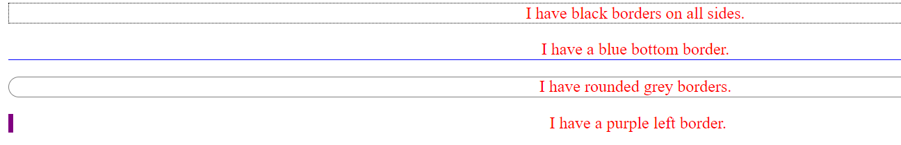
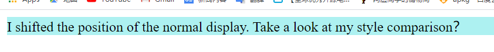

- [CSS learning](#css-learning)
  - [1 What is CSS](#1-what-is-css)
- [2 How to edit the CSS](#2-how-to-edit-the-css)
  - [2.1 The basic grammar of CSS](#21-the-basic-grammar-of-css)
    - [2.1.1 Selector](#211-selector)
  - [2.2 How make it work](#22-how-make-it-work)
    - [2.2.1 Creating a CSS file](#221-creating-a-css-file)
    - [2.2.2 Using the CSS on our HTML](#222-using-the-css-on-our-html)
      - [2.3 The color, size and align](#23-the-color-size-and-align)
  - [2.4 box model](#24-box-model)
  - [2.5 Borders and margins](#25-borders-and-margins)
  - [2.6 The position](#26-the-position)
  - [2.7 The overflow](#27-the-overflow)
  - [2.8 The float](#28-the-float)
  - [2.9 The opacity](#29-the-opacity)
  - [2.10 The combination selector](#210-the-combination-selector)
- [3 The summary](#3-the-summary)
# CSS learning

:smile: ​ **We** have learned that how to write a website belong us in the front studying, we can edit different web by html, but the site is so ordinary that look like a fool, nowadays, the best way to dress our website is add a new measure. just like **CSS**.
  
---

## 1 What is CSS

:+1: **Cascading Style Sheets** (**CSS**) is a [style sheet language](https://en.wikipedia.org/wiki/Style_sheet_language) used for describing the [presentation](https://en.wikipedia.org/wiki/Presentation_semantics) of a document written in a [markup language](https://en.wikipedia.org/wiki/Markup_language) such as [HTML](https://en.wikipedia.org/wiki/HTML).[[1\]](https://en.wikipedia.org/wiki/CSS#cite_note-1) CSS is a cornerstone technology of the [World Wide Web](https://en.wikipedia.org/wiki/World_Wide_Web), alongside HTML and [JavaScript](https://en.wikipedia.org/wiki/JavaScript).[[2\]](https://en.wikipedia.org/wiki/CSS#cite_note-2) .  from [Wiki]([CSS - Wikipedia](https://en.wikipedia.org/wiki/CSS)) 

# 2 How to edit the CSS
## 2.1 The basic grammar of CSS

​	CSS rules is made of two parts, one part is  selector,  another part is a statement or multiple statement.

​	:moon: This rule suggests that "h1" is blue ,  and the size is 12 pixel ！so, the first-level heading will change by this rule .

​	

​	Any statement include a property and a value, color is one of the property, and the blue is a value about "color. color:blue" formed  a statement. the property is style attribute which you want to setting.

​	just like this:

~~~html
/* 这是CSS的注释 */
/* 建议每条申明占一行 */
p{
  color:red;
  text-align:center;  /* 文本居中 */
}
~~~

### 2.1.1 Selector

​	:sailboat: **We** have known that the different website have a different style, so there are a sea of styles to choose,  how to make it easy, or reduce our workload.  CSS selector has gave us a answer,  we can use selector of id and class to change the way about select different style.

---
:smile:**Selector of id**

~~~html
/* Note: There is a # sign before the id selector. */
#sky{
  color: blue;
}
#forest{
    color: green;
}
~~~

when we need use the style. 

~~~css

蓝色的天空

绿色的森林

~~~

**Effection:**

Attention:  Any id can only be unique!

---

:smile: selector of class
:sailboat: Well known, there are too many different device to browse the website, such us ipad, mobile phone, PC, and which have different models, so we need make our site can adapt most device. and then, the class is best choose!

Selector of id is declared by '#'， and the class use '.' to finished it.

CSS:
~~~css
.center{
  text-align: center;
}
.large{
  font-size: 30px;
}
.red{
  color: red;
}
~~~
HTML:
~~~html

我会居中显示的

我是红色的

我又红又大还居中

我也可以是红的

~~~
**Effection:**

---
## 2.2 How make it work

### 2.2.1 Creating a CSS file

**First:** Creating a CSS folder to save our different CSS file!

**What's more:** Creating a file of '.css' in the CSS folder.

**Ultimate:** Plug it what we have edited in the .css file.
~~~CSS
p{
    color:red;
    text-align:center;  /* 文本居中 */
}
#sky{
    color: blue;
}
#forest{
    color: green;
}
.center{
    text-align: center;
  }
  .large{
    font-size: 30px;
  }
  .red{
    color: red;
  }
~~~

---
### 2.2.2 Using the CSS on our HTML

~~~html
<html>
<head>
    <meta charset="utf-8">

    <!-- 注意下面这个语句，将导入外部的 mycss.css 样式表文件 -->
    <link rel="stylesheet"  href="../css/first.css">
    <title>页面标题</title>
</head>
<body>
    
蓝色的天空

    
绿色的森林

    
我会居中显示的

    
我是红色的

    
我又红又大还居中

    
我也可以是红的

</body>
</html>
~~~

As we can see, we use the "\<link>" to import the CSS.

**Effection:**
 

---
#### 2.3 The color, size and align

**:smile:Color:**
:sailboat:**A good site absolute have a suitable color**, it will have a main color tone, but  teaching you how to choose the main color tone isn't what I want to do. there are two website will help you!
[ColorDrop](https://colordrop.io/)或[LOL colors](https://www.webdesignrankings.com/resources/lolcolors/)

---

**:smile: Size:**

:sailboat:We can control the size by set the height or width, we can edit the picel"**px**" or percentage"**%**" to achieve a variety of sizes such as:
HTML:
~~~html
<html>
  <head>
    <link rel="stylesheet" href="./mycss.css">
  </head>
  <body>
    

      这个元素高 200 pixels，占据全部宽度
    

    

      这个元素宽200像素,高300像素
    

  </body>
</html>
~~~
CSS:
~~~css
.example-1 {
  width: 100%;
  height: 200px;
  background-color: powderblue;
  text-align: center;
}
.example-2 {
  height: 100px;
  width: 500px;
  background-color: rgb(73, 138, 60);
  text-align: right;
}
~~~

But, which of the two do you think is the best, certainly, percentage is better than pixel, the website will be more regular becouse of using percentage

---
**:smile: Align:**
:sailboat: I believe everyone knows that symmetry is beautiful, but how to realize it on our site, we can use the alight to maintain the symmetry of the text on the page.

---
## 2.4 box model
**The** box model means that an HTML element can be seen as a box. From inside to outside, this box is composed of content, padding, border, and margin.
As shown below:
 

- Content, such as text, pictures, etc.
- Padding,  is the area between the content and the border
- Border, not displayed by default
- Margin, the area outside the border and other elements

**HTML:**
~~~html
<html>
  <head>
    <link rel="stylesheet" href="./mycss.css">
  </head>
  <body>
    
我是内容一，外面红色的是我的边框。注意边框的内外都有25px的距离。

    
我是内容二，外面蓝色的是我的边框。注意与上面元素的外边距，发生了叠加，不是50px而是25px。

  </body>
</html>
~~~
**CSS:**

~~~css
.box1 {
  height: 200px;
  width: 200px;
  background-color:#615200;
  color: aliceblue;
  border: 10px solid red;
  padding: 25px;
  margin: 25px;
}
.box2 {
  height: 300px;
  width: 300px;
  background-color:#004d61;
  color: aliceblue;
  border: 10px solid blue;
  padding: 25px;
  margin: 25px;
}
~~~

**Effection:**
 

---
## 2.5 Borders and margins

:smile:**In** the front of this part, I have briefly introduced the box model, So I will explain some details of setting the box model in this section.

Any Borders or margins includ top, bottom, left and right, so we can change either side.

**HTML**

~~~HTML

I have black borders on all sides.

I have a blue bottom border.

I have rounded grey borders.

I have a purple left border.

~~~

**CSS**

~~~css
.example-1 {
  border: 1px dotted black; /* Same up, down, left, and right */
}
.example-2 {
  border-bottom: 1px solid blue; /* Set bottom border only */
}
.example-3 {
  border: 1px solid grey;
  border-radius: 15px; /* Border rounded corners */
}
.example-4 {
  border-left: 5px solid purple;
}
~~~

OR more the way to set.

~~~css
padding: 20px; /* 上下左右都相同 */
padding-top: 20px;
padding-bottom: 100px;
padding-right: 50px;
padding-left: 80px;
padding: 25px 50px 75px 100px; /* 简写形式，按上，右，下，左顺序设置 */
padding: 25px 10px; /* 简写形式，上下为25px，左右为10px */
~~~

**Effection:**
 

---

## 2.6 The position
:smile:**The Position** attribute is used to position the element. This attribute has the following values:

- static 
- relative 
- fixed 
- absolute 

:sailboat:**Static:** This is the default positioning method of the element, whether you set it or not, the element will follow the normal page layout.

---
:sailboat:**Relative:** This will offset the element relative to its static position.
**HTML**
~~~HTML

I shifted the position of the normal display. Take a look at my style comparison？
 
~~~

**CSS**
~~~css
.example-relative {
  position: relative;
  left: 60px;
  top: 40px;
  background-color: rgb(173, 241, 241);
}
~~~

**Run style:**
 

**Not run the style**

---
:sailboat:**Fixed:** This will make the element immobile (even if you drag the browser scroll bar up, down, left, and right).

**HTML**
~~~HTML

Footprint area. Please change the size of the browser window and see what happens to the button in the lower right corner?

This button is fixed

~~~

**CSS**
~~~css
.example-fixed {
  position: fixed;
  bottom: 40px;
  right: 10px;
  padding: 6px 24px;
  border-radius: 4px;
  color: #fff;
  background-color: #9d0f0f;
  cursor: pointer;
  box-shadow: 0 3px 3px 0 rgba(0,0,0,0.3), 0 1px 5px 0 rgba(0,0,0,0.12), 0 3px 1px -2px rgba(0,0,0,0.2);
}
.broad {
  height: 5000px;
  width: 5000px;
  padding: 20px;
  background-color: darkkhaki;
}
~~~

**Effection:**
 

---
:sailboat:**Absolute:** this value will cause the element to be offset relative to its most recent parent element that has a positioning attribute set (not static).
If all of the element's parent elements do not have the positioning attribute set, then it is relative to the \<body>  parent element.

**HTML**

~~~HTML

This is parent element
  

    this is son element which have absolute virtue
  

~~~

**CSS**

~~~css
.example-fixed {
  position: fixed;
  bottom: 40px;
  right: 10px;
  padding: 6px 24px;
  border-radius: 4px;
  color: #fff;
  background-color: #9d0f0f;
  cursor: pointer;
  box-shadow: 0 3px 3px 0 rgba(0,0,0,0.3), 0 1px 5px 0 rgba(0,0,0,0.12), 0 3px 1px -2px rgba(0,0,0,0.2);
}
.broad {
  height: 5000px;
  width: 5000px;
  padding: 20px;
  background-color: darkkhaki;
}
~~~

**Effection:**
 

---
## 2.7 The overflow

:smile:**When** the element overflow the margin, we can setting overflow element to solve the problem! This attribute has the following values:

- **visible**: The default value, the overflow part is not cropped, and displayed outside the area
- **hidden**: Cropping the overflow part and not visible
- **scroll**: Crop the overflow part, but provide up and down and left and right scroll bars for display
- **auto**: Crop the overflow part and provide scroll bars as appropriate

**HTML**

~~~HTML

You can use the overflow property when you want to have better control of the
    layout. The overflow property specifies what happens if content overflows an element's box.

~~~

**CSS**

~~~css
.example-overflow-scroll-y {
  width: 200px;
  height: 100px;
  background-color: #eee;
  overflow-y: scroll;
}
~~~

**Effection:**
 

---

## 2.8 The float
:smile:**We** can set the float attribute to move an element to the left or right in the horizontal direction, and the surrounding elements will also be rearranged.
We often use this style to make images and text layout reasonably

**HTML**
~~~HTML
<html>
<head>
  
</head>
<body>
  
  
Lorem ipsum dolor sit amet consectetur, adipisicing elit. Quidem, architecto officiis, repellendus
  corporis obcaecati, et commodi quam vitae vel laudantium omnis incidunt repellat qui eveniet fugiat totam
  modi nam vero!

</body>
</html>
~~~

**Effection:**
 

## 2.9 The opacity
:smile:**We** can use opacity to set the opacity of any element (but often used in images).

**HTML**
~~~HTML
<html>
<head>
  
</head>
<body>
  
  
  
</body>
</html>
~~~

**Effection:**
 

---
## 2.10 The combination selector
:smile:**We** can be combined to get concise and precise choices.Below we introduce two combination selectors.

:sailboat: **Posterior selector:**

**HTML**
~~~HTML
<html>
<head>
  
</head>
<body>
  

    
Paragraph 1 in the div .haha.

    
Paragraph 2 in the div .haha>.

    
        
Paragraph 3 in the div .haha.

    
  

  
Paragraph 4. Not in a div .haha.

  
Paragraph 5. Not in a div .haha.

</body>
</html>
~~~

**Effection:**
 

---

:sailboat: **Child selector:**
**HTML**
~~~HTML
<html>
<head>
  
</head>
<body>
  

    
Paragraph 1 in the div .haha.

    
Paragraph 2 in the div .haha.

    
        
Paragraph 3 in the div .haha - it is descendant but not immediate child.

     <!-- not Child but Descendant -->
  

  
Paragraph 4. Not in a div .haha.

  
Paragraph 5. Not in a div .haha.

</body>
</html>
~~~

**Effection:**
 

# 3 The summary
:smile:**From** this learning process of CSS, I have gained a lot. We can use CSS as an ornament of our HTML to embellish our web pages.
