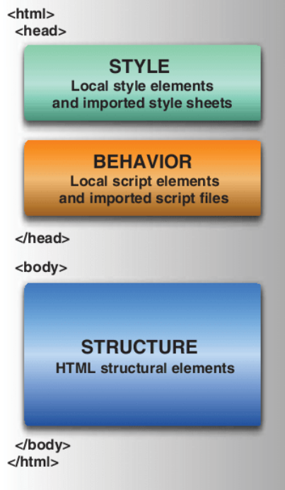
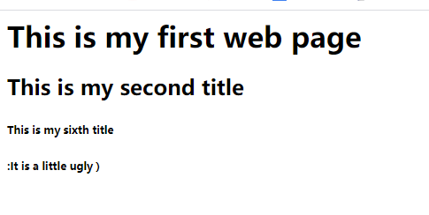
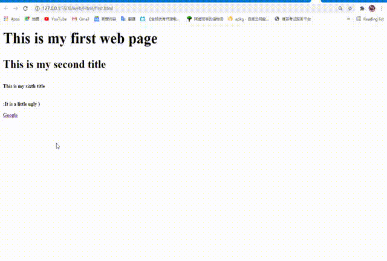
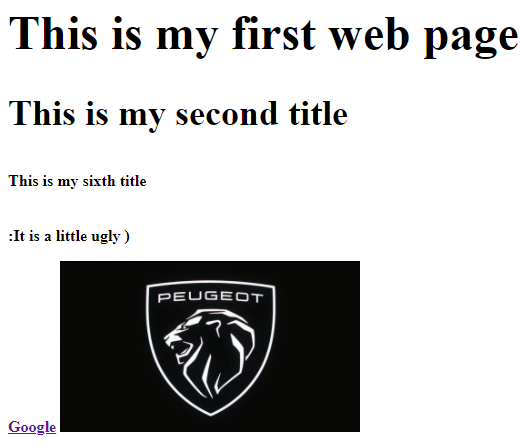
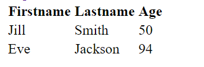
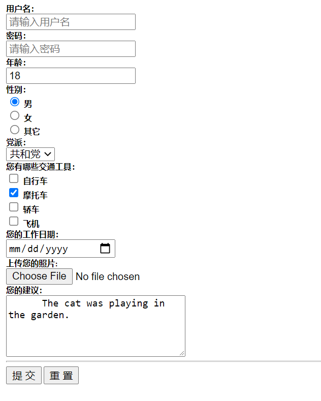

- [1.:house:Why we need development of front end by HTML?](#1housewhy-we-need-development-of-front-end-by-html)
- [2.How to make our HTML file by ourself?](#2how-to-make-our-html-file-by-ourself)
  - [2.1 the tool of production.](#21-the-tool-of-production)
  - [2.2 The based setting on VScode.](#22-the-based-setting-on-vscode)
    - [2.21 Selecting File -> choosing Auto Save](#221-selecting-file---choosing-auto-save)
    - [2.22 creat the different file to save different file on VScode](#222-creat-the-different-file-to-save-different-file-on-vscode)
  - [2.3 what we need to install the plug-in on VScode?](#23-what-we-need-to-install-the-plug-in-on-vscode)
  - [2.4 How to creat a new Html file on VScode](#24-how-to-creat-a-new-html-file-on-vscode)
- [3. make a website by ourself](#3-make-a-website-by-ourself)
  - [3.1 first of all, we need known about the stuct of Html](#31-first-of-all-we-need-known-about-the-stuct-of-html)
  - [3.2 more about Html](#32-more-about-html)
    - [3.21 heading](#321-heading)
    - [3.22 text format](#322-text-format)
    - [3.23 URL(Uniform Resorce Locator)](#323-urluniform-resorce-locator)
    - [3.24 Table](#324-table)
    - [3.25 List](#325-list)
      - [3.25.1 Disorderded list](#3251-disorderded-list)
      - [3.25.2 Ordered list](#3252-ordered-list)
    - [3.26 Form](#326-form)
- [4. the summary](#4-the-summary)
## **Welcome to my first blog about HTML study!!**

   above all, please Mr.wang forgive my terrible English
       
# 1.:house:Why we need development of front end by HTML?
    
>    HTML(Hyper Text Markup Language),we can comprehend what means of HTML from    its name. HTML is a markup language
> which is not programming language, markup language is a set of markup tag, HTML determines the skeleton of web page, 
> we can write ourselves web by the HTML.
    

# 2.How to make our HTML file by ourself?
## 2.1 the tool of production.
 :+1: **VScode(visual stdio code)** is a very magical software :shipit: , VScode can accomplish anything Software engineer's job, 
    for exampale, C/C++ or java or rather python, even said markdowm language. all of then can be writed by VScode.
[vscode download link](https://code.visualstudio.com/)
## 2.2 The based setting on VScode.
### 2.21 Selecting File -> choosing Auto Save
    >when we had finished this, we needn't worry about our code will disapear when we shut off the VScode.
    AS shown:

### 2.22 creat the different file to save different file on VScode
    AS shown:

## 2.3 what we need to install the plug-in on VScode?
 >**Livesever:** when we have finished writing our HTML, we can launch a local development server with live reload feature for static & dynamic
pages.Livesever is very important for the development of web, so I get it out alone
[other plug-in which we need on VScode](https://zhuanlan.zhihu.com/p/113222681)
## 2.4 How to creat a new Html file on VScode  
    AS shouwn:  
  

    attention: file's suffix is .html, such as first.html


# 3. make a website by ourself

## 3.1 first of all, we need known about the stuct of Html
```
<html>
    <head>
        //in here, it include all of we don't want to display to others codes on yourself html page, such us css setting, charactar setting and so on.
    </head>
    <body>
        //main codes are in here.
    </body>
</html>//all of the codes are in here
```
**Having a try now!!!**
```html
<html>
<head>
  <meta charset="utf-8">
  <link rel="shortcut icon" href="favicon.ico" type="image/x-icon">
  <title>the title</title>
</head>
<body>
  <h1>This is my first web page</h1>
  <p>:It is a little ugly )</p>
</body>
</html>
```
**Right click -> choose open with live sever**
  
>let us have a look my first web page  


## 3.2 more about Html
### 3.21 heading
>html provide six levels of titles, we can show the different titles by 
```html
<h1>//1:the levels of titles
```
>**such as:**
```html
<html>
<head>
  <meta charset="utf-8">
  <link rel="shortcut icon" href="favicon.ico" type="image/x-icon">
  <title>the title</title>
</head>
<body>
  <h1>This is my first web page</h1>
  <h2>This is my second title<h2>
  <h6>This is my sixth title<h6>
  <p>:It is a little ugly )</p>
</body>
</html>
```
>:+1:**AS shown:**


### 3.22 text format
>we need know more text format beside ``<h>``
```html
<p>You can use the mark tag to <mark>highlight</mark> text.</p>
<p><del>This line of text is meant to be treated as deleted text.</del></p>
<p><s>This line of text is meant to be treated as no longer accurate.</s></p>
<p><ins>This line of text is meant to be treated as an addition to the document.</ins></p>
<p><u>This line of text will render as underlined</u></p>
<p><small>This line of text is meant to be treated as fine print.</small></p>
<p><strong>This line rendered as bold text.</strong></p>
<p><em>This line rendered as italicized text.</em></p>
```
**As shown:**


-----
-----
### 3.23 URL(Uniform Resorce Locator)
>**There is a saying that there is no URL, no world wide web.**
>:+1: we can show a variety of images or videos or websites and so on by the URL, For example, I am writing this blog, and then I need to show you a picture, then I need the URL.  

----
:smirk:**for example:website**


```html
<a href="https://www.google.com/" target="_blank">Google</a>
```
>:+1:take a view:


>we can click on the Google to visit Google !! please have a try now :smile:
>**:sunglasses:just like this !!!**
- [1.:house:Why we need development of front end by HTML?](#1housewhy-we-need-development-of-front-end-by-html)

>but What does target mean？:astonished:
answer: **target="_blank"** mean we need a new window to open the page. if you don't write target, the system will consider it's :+1:target="_self"

----
:smirk:**for example:image**

>:+1:first of all, you need creat a file folder to save your image!!


>:smile:we can use the picture's URL to Show it to everyone.
```html

```


----

:smirk:**what about more:**
```html
<video src=".mp4" type="video/mp4">
<audio src=".ogg" type="audio/ogg">
........
```
>:+1:It's a good chance to try it.
### 3.24 Table
>**the basic structure**
```html
<table>the table content </table>
<tr>the row of table</tr>
<tr>
<td>cow 1</td><td>cow 2</td><td>cow 3</td>
</tr>
```
>**No more nonsense, just code**
```html
<table>
    <tr>
      <th>Firstname</th>
      <th>Lastname</th>
      <th>Age</th>
    </tr>
    <tr>
      <td>Jill</td>
      <td>Smith</td>
      <td>50</td>
    </tr>
    <tr>
      <td>Eve</td>
      <td>Jackson</td>
      <td>94</td>
    </tr>
  </table>
```
- the effect picture
>
### 3.25 List
>:smile:**we** can use the list to open up our content.
list can be classified ordered list and disordered list

we show the ordered list by ```<ol>```
so the disordered list by ```<ul>```
>for example：
#### 3.25.1 Disorderded list
```html
<ul>
  <li>Coffee</li>
  <li>Tea</li>
  <li>Milk</li>
</ul>
```
- the effect piture:

- we can change the type !
```html
<ul type="square">
  <li>Coffee</li>
  <li>Tea</li>
  <li>Milk</li>
</ul>
```
- just like this

- another choose : type="circle"

#### 3.25.2 Ordered list
```html
<ol>
  <li>Coffee</li>
  <li>Tea</li>
  <li>Milk</li>
</ol>
```
- AS shown：

- the default is sort by number
>other sorting method include "A","a" and so on. the setting method is ```<ol type="a">```
### 3.26 Form
:smile: **Form** is useful when the site need our username, password or options
for excample :
```html
<form>
  <!-- 文本框，注意有 placeholder 提示符 -->
  用户名：<br>
  <input type="text" name="name" placeholder="请输入用户名"><br>
  <!-- 密码框 -->
  密码：<br>
  <input type="password" name="ps" placeholder="请输入密码"><br>
  年龄：<br>
  <!-- 数字输入框，注意 min 和 value 属性-->
  <input type="number" name="age" min="18" value="18"><br>
  <!-- 单选按钮, 注意 checked 属性 -->
  性别：<br>
  <input type="radio" name="gender" value="male" checked> 男<br>
  <input type="radio" name="gender" value="female"> 女<br>
  <input type="radio" name="gender" value="other"> 其它<br>
  <!-- 下拉列表，注意 selected 属性 -->
  党派：<br>
  <select name="party">
    <option value="D">民主党</option>
    <option value="R" selected>共和党</option>
    <option value="N">无党派</option>
  </select><br>
  <!-- 多选框 -->
  您有哪些交通工具：<br>
  <input type="checkbox" name="vehicle1" value="Bike"> 自行车<br>
  <input type="checkbox" name="vehicle2" value="Motocycle" checked> 摩托车<br>
  <input type="checkbox" name="vehicle3" value="Car"> 轿车<br>
  <input type="checkbox" name="vehicle4" value="Jet"> 飞机<br>
  <!-- 日期选择器 -->
  您的工作日期：<br>
  <input type="date"><br>
  <!-- 文件选择器 -->
  上传您的照片:<br>
  <input type="file" name="photo"><br>
  <!-- 文本输入区域，注意 rows 和 cols 属性 -->
  您的建议：<br>
  <textarea name="message" rows="5" cols="30">
    The cat was playing in the garden.
  </textarea><br><hr>
  <!-- 表单提交/重置按钮，将表单中的数据取消或传输给服务器端进行处理 -->
  <input type="submit" value="提 交">
  <input type="reset" value="重 置">
</form>
```
- effect picture:

# 4. the summary 
**IN** this part, we have learned how to write a basic site code, besides that, we finished the showing on the website by liveserve, that is amazing but the our site is so ordinary, so we will learn how to dress our site at next part.
